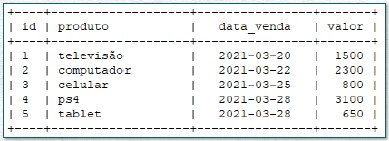
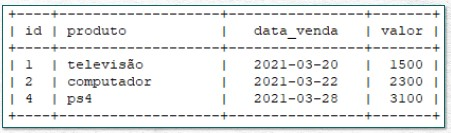
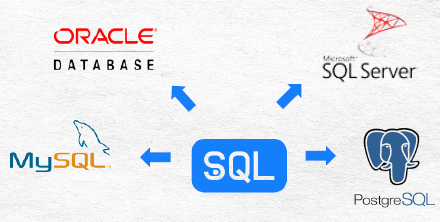

<p align="center">
	  <a href='https://jonasaacampos.github.io/portfolio/'>
      
      </a>
</p>


<h1>SQL - um guia para autoditadas</h1>

Notas, projetos e insights gerados ao longo dos meus estudos de SQL, com o objetivo de documentar o aprendizado para futuras consultas e auxiliar interessados e estudantes da área. Além de exercícios com questões reais de negócios, você pode usar os códigos disponibilizados para expadir seus horizontes sobre banco de dados.

Divirta-se!

<h2>Pra quem este guia não é</h2>

- [ ] Você deseja aprender sobre SQL em 10 horas ou menos?
- [ ] Você tem preguiça de ler e de fazer exercícios com casos reais?

Se você respondeu sim para quaisquer uma destas perguntas, **este documento não é para você**. Vasculhe meu repositório à procura de outros projetos que talvez te ajude.

[](https://jonasaacampos.github.io/portfolio/)
[](https://www.linkedin.com/in/jonasaacampos)

<h2>Cobertura do conteúdo estudado</h2>

    Repositório em constante atualização. Volte sempre ;D
    
- [X] Introdução
- [X] Criação do ambiente
- [X] Ordenamento
- [X] Filtros
- [X] Funções de agregação
- [X] Agrupamento de dados
- [X] JOINs
- [X] JOINS + GROUP BY
- [ ] Variáveis
- [ ] Manipulação de Strins e Datas
- [ ] Funções condicionais
- [ ] SQL views
- [ ] CRUD
- [ ] Functions
- [ ] Store Procedures
- [ ] Window Functions
- [ ] Regex

-------
## Table of Contents

- [Table of Contents](#table-of-contents)
- [Introdução (Começe por aqui)](#introdução-começe-por-aqui)
  - [🎲🎲Dados 🎲🎲](#dados-)
  - [**Banco de Dados**](#banco-de-dados)
  - [**SQL**](#sql)
  - [SGBD](#sgbd)
  - [MySQL, SQL Server, Oracle ou PostgreSQL?](#mysql-sql-server-oracle-ou-postgresql)
  - [SQL Server (Preparação do ambiente)](#sql-server-preparação-do-ambiente)
  - [Preparando ambiente](#preparando-ambiente)
    - [Windows](#windows)
    - [Linux](#linux)
- [Conhecendo a base de dados](#conhecendo-a-base-de-dados)
- [SELECT](#select)
  - [SELECT TOP(N) || SELECT TOP(N) PERCENT](#select-topn--select-topn-percent)
  - [SELECT DISTINCT](#select-distinct)
  - [AS](#as)
  - [Resumo](#resumo)
  - [Exercícios](#exercícios)
- [Ordenação de dados (ORDER BY)](#ordenação-de-dados-order-by)
- [Filtro de dados (WHERE)](#filtro-de-dados-where)
    - [Exercícios com WHERE](#exercícios-com-where)
  - [IN](#in)
  - [LIKE](#like)
  - [BETWEEN](#between)
  - [IS NULL // IS NOT NULL](#is-null--is-not-null)
  - [Exercícios](#exercícios-1)
- [Funções de Agregação](#funções-de-agregação)
  - [SUM](#sum)
  - [COUNT](#count)
  - [COUNT DISTINCT](#count-distinct)
  - [MIN E MAX](#min-e-max)
  - [AVG](#avg)
  - [Exercícios](#exercícios-2)
- [GROUP BY](#group-by)
  - [GROUP BY + ORDER BY](#group-by--order-by)
  - [GROUP BY + WHERE + ORDER BY](#group-by--where--order-by)
  - [HAVING](#having)
  - [Exercícios](#exercícios-3)
- [JOINS no SQL](#joins-no-sql)
  - [Chave Primária e Chave Estrangeira](#chave-primária-e-chave-estrangeira)
  - [Tabela Fato e Tabela Dimensão](#tabela-fato-e-tabela-dimensão)
  - [Tipos de JOIN](#tipos-de-join)
  - [**Exemplo dos JOINS**](#exemplo-dos-joins)
  - [Exercícios](#exercícios-4)
- [JOINS + Agrupamentos](#joins--agrupamentos)
  - [Exercícios](#exercícios-5)
  - [Variáveis](#variáveis)
- [Contato](#contato)
- [Crédito das imagens](#crédito-das-imagens)

## Introdução (Começe por aqui)

### 🎲🎲Dados 🎲🎲

Dado é uma informação sobre alguma coisa.

Em uma empresa, os dados cumprem um papel tão importante quanto qualquer outro bem. Porém, para extrair o melhor de um dado, não basta tê lo, é preciso organizá lo para então entendê lo.

### **Banco de Dados**

Bancos de dados são conjuntos de tabelas, com alguma relação entre si, com dados sobre pessoas, lugares ou coisas.

Dados isolados possuem valor. Dados organizados e agrupados possuem mais valor ainda.

    > Dado ➡️ Tabela ➡️ Banco de dados

### **SQL**

O SQL(Structured Query Language) é uma linguagem padrão para trabalhar com bancos de dados relacionais. Se trata de uma linguagem de programação que permite a manipulação dos

dados em um banco de dados.

Imagine uma tabela com os dados de todas as vendas



Para exibir todas as vendas com valor maior que R$1.000 podemos usar uma consulta (query), que retornará uma nova tabela.

```sql
SELECT * FROM tabela_vendas WHERE valor > 1000
```



### SGBD

Um SGBD permite ao desenvolvedor trabalhar com diferentes tabelas de um banco de dados através de uma interface. Além da interface temos um servidor, onde são armazenados os bancos de dados.

Abaixo, temos os 4 principais programas para SGBDs (todos utilizam o SQL como linguagem de programação).

| SGBD                                                                                                        | Descrição                                                                                                                                    |
| ----------------------------------------------------------------------------------------------------------- | :------------------------------------------------------------------------------------------------------------------------------------------- |
|          | MySQL: É um SGBD relacional de código aberto, usado na maioria das aplicações gratuitas. A interface de código utilizada é o MySQLWorkbench. |
|   | Oracle: O SGBD da Oracle é focado em empresas de médio e grande porte. A interface de código utilizada é o SQL Developer.                    |
|   | SQL Server: O SQL Server é o SGBD criado pela Microsoft, também para bancos de dados relacionais. A interface de código utilizada é o SSMS.  |
|  | Postgre SQL: Criado em 1989 e ainda um dos mais utilizados no mundo. A interface de código utilizada é o pgAdmin.                            |

----

### MySQL, SQL Server, Oracle ou PostgreSQL?

<p align="center">

</p>

> Qualquer um serve. 👨🏾‍💻 O SQL você vai precisar aprender em qualquer um dos casos.

O SQL é usado como a linguagem padrão em todos os sistemas de gerenciamento de banco de dados relacional. No entanto, o SQL possui algumas vertentes que dependem de cada sistema de gerenciamento de banco de dados, onde cada SGBD incorpora à linguagem algumas funcionalidades e recursos extras.




- **TSQL, ou T SQL (Transaction SQL)**
    
    É uma versão aprimorada do SQL que contém algumas extensões. Originalmente desenvolvido pela Sybase e agora é propriedade da Microsoft. O T SQL adiciona alguns recursos avançados ao SQL para torná-lo mais poderoso, como variáveis declaradas, controle de transação, tratamento de erros e exceções, operações com *strings,* processamento de data e hora, etc
- **PLSQL ou Procedural Language /SQL**
    É outra forma estendida de SQL que é usada pela Oracle para seu banco de dados. A principal diferença entre o T SQL e o PL SQL é a maneira como eles lidam com variáveis, procedimentos armazenados e funções integradas. TSQL também é considerado mais fácil e simples de entender, enquanto PL SQL incorpora maior complexidade.
- **PL-pgSQL**
    É uma linguagem procedural específica do PostgreSQL baseada em SQL. Semelhante ao T SQL e PL SQL, ele adiciona alguns recursos avançados ao SQL, como loops, variáveis, tratamento de erros e exceções, etc.
---

### SQL Server (Preparação do ambiente)

Aqui vai um guia para a instalação das ferramentas necessárias para manipulação de banco de dados. Aqui usarei o SQL Server.

<details>
<summary><strong>Preparando ambiente</strong></summary>

### Preparando ambiente

#### Windows

- [ ]  SQL Server Developer Edition
- [ ]  [SSMS](https://docs.microsoft.com/pt-br/sql/ssms/download-sql-server-management-studio-ssms?redirectedfrom=MSDN&view=sql-server-ver16)
- [ ]  ContosoBIdemoBAK.exe (extrair arquivo)

#### Linux

```bash
# importe a chave pública da microsoft
wget -qO- https://packages.microsoft.com/keys/microsoft.asc | sudo apt-key add -

# confira a versaão do seu linux
hostnamectl

# Registre o repositório do Ubuntu do Microsoft SQL Server para o SQL Server 2019:
# UBuntu 20.04
sudo add-apt-repository "$(wget -qO- https://packages.microsoft.com/config/ubuntu/20.04/mssql-server-2019.list)"

# atualize a lista de repositórios e instale o SQL server
sudo apt-get update | sudo apt-get install -y mssql-server

# execute o instalador
sudo /opt/mssql/bin/mssql-conf setup

#Após a instação, confira se o serviço está em execução
systemctl status mssql-server --no-pager

## Como SGBD utilize o Dbeaver (ou outro de sua preferência)
```

- Para restaurar o Banco de dados da Contoso
    
    
    
    
    
</details>

---

[🏠 Retornar ao índice](#table-of-contents)

## Conhecendo a base de dados


A empresa Contoso Corporation é uma empresa multinacional fictícia ( com sede em Paris e com escritórios espalhados ao longo de todo o mundo. Realiza fabricação, vendas e suporte, com mais de **100.000 produtos**. Por ser uma empresa multinacional, utiliza um SGBD da Microsoft (SQL Server) para centralizar e manipular o grande volume de dados associados ao negócio. Possui mais de **25 mil funcionários** espalhados ao longo das dezenas de escritórios no mundo.


---

[🏠 Retornar ao índice](#table-of-contents)

## SELECT

> Comando SELECT ... FROM : retorna todas as linhas da tabela, independente das colunas selecionadas
> 

```sql
/*Seleciona todas as colunas de uma determinada tabela*/
SELECT * FROM DimCustomer
SELECT * FROM DimStore;
SELECT * FROM DimProduct

/*Traz somente informações úteis para a aplicação usuário final*/
SELECT StoreKey, StoreName, StorePhone FROM dimStore;
SELECT ProductName, BrandName FROM DimProduct

-- isso é um comentário de uma linha
/*
 isso é um comentário de bloco
*/
```


Exibindo todos os dados da tabela de lojas (SELECT * FROM DimStore;) ... Mas eu gostaria de APENAS o nome, o código e o telefone das lojas!


> Voilà! (SELECT StoreKey, StoreName, StorePhone FROM dimStore;)

---

### SELECT TOP(N) || SELECT TOP(N) PERCENT

> SELECT TOP(n) || SELECT TOP(n) PERCENT : retorna as N primeiras linhas

```sql
/*1. Crie uma consulta que retorne as 10 primeiras linhas da tabela produtos*/
SELECT TOP(10) * FROM DimProduct

/*2. Crie uma consulta que retorne as 10% primeiras linhas da tabela produtos*/
SELECT TOP(10) PERCENT * FROM DimProduct

-- a tabela FactSales (vendas) possui cerca de 3 MILHÕES de linhas
SELECT TOP(100) * FROM FactSales
```

### SELECT DISTINCT

> SELECT DISTINCT : Retorna os valores distintos de uma tabela
> 

```sql
/* 1. Retorne todos os valores distindos da coluna ColorName da tabela dimProdutc*/
SELECT 
	DISTINCT ColorName
FROM
	DimProduct

/*2. Quais os departamento existem na empresa (tabela DimEmployee)*/
SELECT
	DISTINCT DepartmentName
FROM
	DimEmployee
```

### AS

> AS : Renomeia colunas (aliasing) na consulta
> 

```sql
/*Selecione 3 colunas da tabela dimProduct: ProdutcName, BrandName e ColorName*/

SELECT
	ProductName AS Produto,
	BrandName	AS Marca,
	ColorName	AS Cor
FROM
	DimProduct

-- O uso de 'aspas' é obrigatório caso o nome do campo seja composto.
```

### Resumo

```sql
SELECT * FROM tabela 
--exibe toda a tabela

SELECT Coluna1, Coluna2, ..., FROM tabela 
--exibe apenas colunas selecionadas

SELECT DISTINCT Coluna1 * FROM tabela 
--exibe valores únicos de determinada coluna

SELECT TOP(N) * FROM tabela
SELECT TOP(N) PERCENT * FROM tabela
--exibe os primeiros N registros//primeiros % registros

SELECT Coluna1 AS 'Novo Nome' FROM tabela
--renomeia as colunas consultadas
```

### Exercícios

<details>
<summary><strong>Exercícios e respostas</strong></summary>

1. Você é responsável por controlar os dados de clientes e de produtos da sua empresa. O que você precisará fazer é confirmar se:
    1. Existem 2.517 produtos cadastrados na base e, se não tiver, você deverá reportar ao seu gestor para saber se existe alguma defasagem no controle dos produtos.
    2. Até o mês passado, a empresa tinha um total de 19.500 clientes na base de controle. Verifique se esse número aumentou ou reduziu.
    - **Solução Exercício 1:**
        
        ```sql
        --A. Verificando quantidade de produtos cadastrados
        SELECT 
        	DISTINCT ProductName
        FROM 
        	DimProduct
        /*A consulta trouxe 2.517 registros, portanto não há defasagem no controle de produtos*/
        
        -- B. Verificando quantidade de clientes atual
        SELECT
        	*
        FROM
        	DimCustomer
        /*A consulta listou 18.869 registros, portanto o número de cadastros de clientes reduziu comparado ao mês anterior*/
        ```
        
2. Você trabalha no setor de marketing da empresa Contoso e acaba de ter uma ideia de oferecer descontos especiais para os clientes no dia de seus aniversários. Para isso, você vai precisar listar todos os clientes e as suas respectivas datas de nascimento, além de um contato.
    1. Selecione as colunas: CustomerKey, FirstName, EmailAddress, BirthDate da tabela dimCustomer.
    2. Renomeie as colunas dessa tabela usando o alias (comando AS).
    - **Solução Exercício 2:**
        
        ```sql
        -- verificando as colunas da tabela clientes
        SELECT TOP(10) * FROM  DimCustomer
        
        -- A. mostre apenas informações úteis para o marketing para a campanha de aniversário
        -- b. Renomeie as colunas usando o comando AS
        
        SELECT
        	CustomerKey		AS 'ID',
        	FirstName		AS 'Nome',
        	EmailAddress	AS 'e-mail',
        	BirthDate		AS 'Data Nacimento'
        FROM
        	DimCustomer
        ```
        
        
        
3. A Contoso está comemorando aniversário de inauguração de 10 anos e pretende fazer uma ação de premiação para os clientes. A empresa quer presentear os primeiros clientes desde a inauguração. Você foi alocado para levar adiante essa ação. Para isso, você terá que
fazer o seguinte:
    1. A Contoso decidiu presentear os primeiros 100 clientes da história com um vale compras de R$ 10.000. Utilize um comando em SQL para retornar uma tabela com os primeiros 100 primeiros clientes da tabela dimCustomer (selecione todas as colunas).
    2.  A Contoso decidiu presentear os primeiros 20% de clientes da história com um vale compras de R$ 2.000. Utilize um comando em SQL para retornar 20% das linhas da sua tabela dimCustomer (selecione todas as colunas). 
    3. Adapte o código do item a) para retornar apenas as 100 primeiras linhas, mas apenas as colunas FirstName, EmailAddress, BirthDate. 
    4. Renomeie as colunas anteriores para nomes em português
    - **Solução Exercício 3:**
        
        ```sql
        -- A. Selecione os 100 primeiros registros da tabela de clientes
        SELECT TOP(100) * FROM  DimCustomer
        
        -- B. Selecione os primeiros 20% dos clientes
        SELECT TOP(20) PERCENT * FROM DimCustomer
        
        -- C. Exiba apenas as colunas  FirstName, EmailAddress, BirthDate. 
        SELECT
        	FirstName,
        	EmailAddress,
        	BirthDate
        FROM
        	DimCustomer
        
        -- D. Renomeia as colunas para português
        SELECT
        	FirstName		  AS Nome,
        	EmailAddress	AS 'e-mail',
        	BirthDate		  AS nascimento
        FROM
        	DimCustomer
        ```
        
4. A empresa Contoso precisa fazer contato com os fornecedores de produtos para repor o estoque. Você é da área de compras e precisa descobrir quem são esses fornecedores. Utilize um comando em SQL para retornar apenas os nomes dos fornecedores na tabela dimProduct e renomeie essa nova coluna da tabela.
    - **Solução Exercício 4:**
        
        ```sql
        -- verificando tabela de produtos
        SELECT TOP(10) * FROM DimProduct
        -- exiba o nome dos fornecedores
        SELECT 
        	DISTINCT Manufacturer AS 'Fornecedores'
        FROM 
        	DimProduct
        ```
        
        
        
5. O seu trabalho de investigação não para. Você precisa descobrir se existe algum produto registrado na base de produtos que ainda não tenha sido vendido. Tente chegar nessa informação. Obs: caso tenha algum produto que ainda não tenha sido vendido, você não precisa descobrir qual é, é suficiente saber se teve ou não algum produto que ainda não foi vendido.
    - **Solução Exercício 5:**
        
        ```sql
        -- verificando tabela de produtos
        SELECT * FROM DimProduct
        
        /*Existem 2.517 registros*/
        
        -- Verificando tabela de Vendas (cerca de 3 milhões de registros...)
        SELECT TOP(10) * FROM FactSales
        
        SELECT
        	DISTINCT ProductKey
        FROM
        	FactSales
        
        /*consulta trouxe 2.516 registros, logo pode-se afirmar que existe 1 produto que não foi vendido*/
        ```
              
</details>

---

[🏠 Retornar ao índice](#table-of-contents)

## Ordenação de dados (ORDER BY)

> ORDER BY é usado para ordenar os valores de uma tabela em ordem crescente ou decrescente

```sql
SELECT TOP(100) * FROM DimStore
ORDER BY EmployeeCount
-- quando não especifico a sequência da ordenação, o resultado trará a ordenação ASC (ascendente)
```

```sql
/* SELECIONE AS 10 PRIMEIRAS LINHAS DA TABELA DE PRODUTOS, 
E ORDENE DE ACORDO COM O CUSTO*/
SELECT
	TOP(10) 
	ProductName,
	UnitCost,
	Weight
FROM
	DimProduct
ORDER BY UnitCost DESC, Weight DESC
```

## Filtro de dados (WHERE)

> WHERE é um filtro de dados. Traz somente registros que atendam determinada condição
> 

```sql
--  Quantos produtos custam mais de U$1.000?
SELECT
	ProductName AS Produto,
	UnitPrice	AS Preço
FROM
	DimProduct
WHERE UnitPrice >= 1000
ORDER BY UnitPrice
```

**Filtro de texto**

```sql
-- Quantas marcas existem na tabela de produtos?
SELECT DISTINCT BrandName FROM DimProduct
/* Existem 11 Marcas*/

-- Quantos produtos da marca Wide World Importers estão cadastrados
SELECT DISTINCT * FROM DimProduct
WHERE BrandName = 'Wide World Importers'
/*173 produtos*/
```

**Filtro de data**

```sql
-- Quantos clientes nasceram após 31/12/1970
SELECT * FROM DimCustomer
WHERE BirthDate >= '1970-12-31'
ORDER BY BirthDate DESC
```

**Operadores Lógicos**

```sql
SELECT * FROM DimProduct

-- produtos da Fabrikam da cor preta
SELECT * FROM DimProduct
WHERE BrandName = 'Fabrikam' AND ColorName='Black'

-- produtos da Contoso ou Fabrikam. (Em geral usa-se o OR dentro de uma mesma coluna)
SELECT * FROM DimProduct
WHERE BrandName = 'Contoso' OR BrandName='Fabrikam'

--todos os funcionários, exceto o Marketing
SELECT * FROM DimEmployee
WHERE NOT DepartmentName = 'Marketing'
```

#### Exercícios com WHERE

<details>
<summary><strong>Respostas e exercícios</strong></summary>
    
    ```sql
    -- 1. Selecione todas as linhas da tabela dimEmployee cujos funcionários sejam do sexo feminino do departamento de finanças
    SELECT * FROM	DimEmployee
    WHERE Gender = 'F' AND DepartmentName = 'Finance' 
    
    -- 2. Mostre todas as linhas com os produtos vermelhos com valor de venda maior ou igual a U$100 da marca Contoso.
    SELECT * FROM DimProduct
    WHERE BrandName = 'Contoso' AND ColorName = 'red' AND UnitPrice >= 100
    
    -- 3. Exiba todas as linhas dos produtos das marcas Litware, Fabrikam ou Pretos
    SELECT * FROM DimProduct
    WHERE BrandName = 'Fabrikam' OR BrandName = 'Litware' OR ColorName = 'Black'
    ORDER BY ColorName
    
    -- 4. Selecione todas as linhas da tabela dimSalesTerrutory (locais de abrangência das vendas) do continente europeu, exceto da Itália.
    SELECT * FROM DimSalesTerritory
    WHERE SalesTerritoryGroup = 'Europe' AND NOT SalesTerritoryCountry = 'Italy'
    
    -- 5. Mostre todas as linhas da tablea de produtos (dimProduct) cuja cor seja Preta ou Vermelho da Marca Fabrikam
    SELECT * FROM DimProduct
    WHERE (ColorName = 'Black' OR ColorName = 'Red') AND BrandName = 'Fabrikam'
    ```
</details> 

### IN

> O operador IN permite que sejam especificados múltiplos critérios dentro do WHERE **é uma alternativa reduzida ao OR**
> 

```sql
SELECT * FROM DimProduct
WHERE ColorName IN ('Silver', 'Blue', 'White', 'Red', 'Black')

SELECT * FROM DimEmployee
WHERE DepartmentName IN ('Production', 'Marketing', 'Engineering')
ORDER BY DepartmentName
```

### LIKE

> O LIKE é usado em conjunto com o WHERE para **procurar por um determinado padrão em uma coluna**.
> 

```sql
--Mostre todos os produtos MP3 player
SELECT * FROM DimProduct
WHERE ProductName LIKE '%MP3 Player%'

--Mostre todas os produtos cuja descrição COMECE com 'Type'
SELECT * FROM DimProduct
WHERE ProductDescription LIKE 'Type%'
```

O sinal de **%** representa zero, um ou múltiplos caracteres.

O **_** representa um único caractere


### BETWEEN

> O BETWEEN seleciona valores em um intervalo Estes valores podem ser números, textos ou datas

```sql
SELECT * FROM DimProduct
WHERE UnitPrice BETWEEN 50 AND 100

SELECT * FROM DimProduct
WHERE UnitPrice NOT BETWEEN 50 AND 100
```

*O BETWEEN é inclusivo ou seja, os valores dos extremos (valor inicial e valor final) também são incluídos no intervalo*

**Filtrando intervalo de datas**

```sql
SELECT * FROM DimEmployee
WHERE HireDate BETWEEN '2000-01-01' AND '2000-12-31'
```

### IS NULL // IS NOT NULL

> Podemos encontrar valores nulos (em branco) em uma tabela

```sql
-- Exibe somente clientes PJ
SELECT * FROM DimCustomer
WHERE CompanyName IS NOT NULL
```

### Exercícios

<details>
<summary><strong>Respostas e Exercícios</strong></summary>

1. Você é o gerente da área de compras e precisa criar um relatório com as TOP 100 vendas, de acordo com a quantidade vendida. Você precisa fazer isso em 10min pois o diretor de compras solicitou essa informação para apresentar em uma reunião.
Utilize seu conhecimento em SQL para buscar essas TOP 100 vendas, de acordo com o total vendido (SalesAmount).
    - **Resposta Exercício 1**
        
        ```sql
        -- Mostre as top 100 vendas com maior quantidade vendida
        SELECT 
        	TOP(100) *	
        FROM 
        	FactSales
        ORDER BY 
        	SalesQuantity DESC
        ```
        
2. Os TOP 10 produtos com maior UnitPrice possuem exatamente o mesmo preço. Porém, a empresa quer diferenciar esses preços de acordo com o peso (Weight) de cada um.
O que você precisará fazer é ordenar esses top 10 produtos, de acordo com a coluna de UnitPrice e, além disso, estabelecer um critério de desempate, para que seja mostrado na ordem, do maior para o menor.  
Caso ainda assim haja um empate entre 2 ou mais produtos, pense em uma forma de criar um segundo critério de desempate (além do peso).
    - **Resposta Exercício 2**
        
        ```sql
        -- 
        SELECT 
        	TOP(10) *	
        FROM 
        	DimProduct
        ORDER BY 
        	UnitPrice DESC, 
        	Weight DESC,
        	ColorID
        ```
        
3. Você é responsável pelo setor de logística da empresa Contoso e precisa dimensionar o transporte de todos os produtos em categorias, de acordo com o peso.
Os produtos da categoria A, com peso acima de 100kg, deverão ser transportados na primeira leva.
Faça uma consulta no banco de dados para descobrir quais são estes produtos que estão na categoria A.
    1. Você deverá retornar apenas 2 colunas nessa consulta: Nome do Produto e Peso.
    2. Renomeie essas colunas com nomes mais intuitivos.
    3. Ordene esses produtos do mais pesado para o mais leve.
    - **Resposta Exercício 3**
        
        ```sql
        -- Exiba todos os produtos com peso maior que 100kg. traga apenas coluna de nome e peso
        SELECT
        	ProductName AS Produto,
        	Weight		AS Peso
        FROM
        	DimProduct
        WHERE 
        	Weight > 100
        ORDER BY
        	Weight DESC
        ```
        
        
        
4. Você foi alocado para criar um relatório das lojas registradas atualmente na Contoso.
    1. a) Descubra quantas lojas a empresa tem no total. Na consulta que você deverá fazer à tabela DimStore, retorne as seguintes informações: StoreName, OpenDate, EmployeeCount
    2. Renomeeie as colunas anteriores para deixar a sua consulta mais intuitiva.
    3. Dessas lojas, descubra quantas (e quais) lojas ainda estão ativas.
        - **Resposta Exercício 4**
            
            ```sql
            -- Quantas lojas estão registradas na Contoso hoje?
            SELECT 
            	StoreName		AS 'Nome da Loja',
            	OpenDate		AS 'Data de Abertura',	
            	EmployeeCount	AS 'Número de funcionários'
            FROM
            	DimStore
            --WHERE Status = 'On' --294 lojas ativas
            --WHERE Status = 'Off' --12 lojas ativas
            
            /* A Contoso possui na data atual 306 lojas cadastras, 
            	sendo deste montante 264 ativas e 12 inativas.
            */
            
            --SELECT TOP(10) * FROM DIMSTORE
            ```
            
5.  O gerente da área de controle de qualidade notificou à Contoso que todos os produtos Home Theater da marca Litware, disponibilizados para venda no dia 15 de março de 2009, foram identificados com defeitos de fábrica.
O que você deverá fazer é identificar os ID’s desses produtos e repassar ao gerente para que ele possa notificar as lojas e consequentemente solicitar a suspensão das vendas desses produtos.
    - **Resposta Exercício 5**
        
        ```sql
        -- Informe uma lista de IDs dos produtos Home Theater da Litware, vendidos a partir de 15/03/2009 para serem retirados da venda
        --SELECT TOP(10) * FROM DimProduct
        SELECT 
        	*
        FROM 
        	DimProduct
        WHERE
        	BrandName = 'Litware' AND 
        	--ProductDescription LIKE '%Home Theater%' AND
        	AvailableForSaleDate = '20090315'
        -- filtro para 'home theather' quebra a consulta por conta do formato do campo de data (time series)
        
        /*Dos produtos com defeito, precisam ser retirados da venda os cujos ID são: 198, 214 e 230*/
        ```
        
6. Imagine que você precise extrair um relatório da tabela DimStore, com informações de lojas. Mas você precisa apenas das lojas que não estão mais funcionando atualmente.
    1. Utilize a coluna de Status para filtrar a tabela e trazer apenas as lojas que não estão mais funcionando.
    2. Agora imagine que essa coluna de Status não existe na sua tabela. Qual seria a outra forma que você teria de descobrir quais são as lojas que não estão mais funcionando?
    - **Resposta Exercício 6**
        
        ```sql
        SELECT 
        	*
        FROM
        	DimStore
        --WHERE Status = 'Off'
        WHERE CloseReason IS NOT NULL
        
        -- SELECT DISTINCT	CloseReason FROM DimStore
        -- NULL, Realocation, Store
        
        /*Caso não existisse a coluna status, para consultar as lojas inativas poderímos usar o parâmetro não nulo,
        pois se a razão de fechamento estiver preenchida, significa que a loja foi fechada*/
        ```
        
7. De acordo com a quantidade de funcionários, cada loja receberá uma determinada quantidade de máquinas de café. As lojas serão divididas em 3 categorias: 
    1. CATEGORIA 1: De 1 a 20 funcionários -> 1 máquina de café
    2. CATEGORIA 2: De 21 a 50 funcionários -> 2 máquinas de café
    3. CATEGORIA 3: Acima de 51 funcionários -> 3 máquinas de café
        1. (Identifique, para cada caso, quais são as lojas de cada uma das 3 categorias acima (basta fazer uma verificação).)
    - **Resposta Exercício 7**
        
        ```sql
        SELECT * FROM DimStore
        ORDER BY EmployeeCount
        
        -- quantas máquinas de café cada loja receberá?
        -- categoria A: de 01-20 funcionários
        SELECT
        	StoreName,
        	EmployeeCount
        FROM
        	DimStore
        WHERE 
        	-- CATEGORIA A
        	EmployeeCount BETWEEN 1 AND 20
        	
        	-- CATEGORIA B
        	--EmployeeCount BETWEEN 21 AND 50
        
        	--CATEGORIA C
        	--EmployeeCount >= 51
        ORDER BY EmployeeCount ASC
        
        /*
        Total de Lojas: 306
        
        Lojas por categorias
        Categoria A: 75  lojas
        Categoria B: 187 lojas
        Categoria C: 43  lojas
        */
        ```
        
8. A empresa decidiu que todas as televisões de LCD receberão um super desconto no próximo mês. O seu trabalho é fazer uma consulta à tabela DimProduct e retornar os ID’s, Nomes e Preços de todos os produtos LCD existentes.
    - **Resposta Exercício 8**
        
        ```sql
        -- Exiba todos os produtos LCD (ID, nome e preços)
        SELECT 
        	ProductKey			AS 'ID',
        	ProductDescription	AS 'Produto',
        	UnitPrice			AS 'Preço'
        FROM
        	DimProduct
        WHERE
        	ProductDescription LIKE '%LCD%'
        ORDER BY
        	UnitPrice DESC
        ```
        
        
        
9. Faça uma lista com todos os produtos das cores: Green, Orange, Black, Silver e Pink. Estes produtos devem ser exclusivamente das marcas: Contoso, Litware e Fabrikam.
    - **Resposta Exercício 9**
        
        ```sql
        -- Liste os produtos Green, Orange, Black, Silver e Pink das Marcas Contoso, Litware e Fabrikam
        SELECT 
        	*
        FROM
        	DimProduct	
        WHERE 
        	ColorName IN ('Green', 'Orange', 'Black', 'Silver', 'Pink') AND
        	BrandName IN ('Contoso', 'Litware', 'Fabrikam')
        ORDER BY
        	ColorName
        ```
        
10. A empresa possui 15 produtos da marca Contoso, da cor Silver e com um UnitPrice entre 10 e 30. Descubra quais são esses produtos e ordene o resultado em ordem decrescente de acordo com o preço (UnitPrice).
    - **Resposta Exercício 10**
        
        ```sql
        SELECT
        	ProductName AS 'Produto',
        	UnitPrice	AS 'Preço'
        FROM
        	DimProduct
        WHERE
        	BrandName = 'Contoso'	AND
        	ColorName = 'Silver'	AND
        	UnitPrice BETWEEN 10 AND 30
        ORDER BY
        	UnitPrice DESC
        ```

</details>    

---

[🏠 Retornar ao índice](#table-of-contents)

## Funções de Agregação

### SUM

> Retorna o total de uma determinada coluna

```sql
SELECT
	SUM(SalesQuantity) AS 'Total Vendido',
	SUM(ReturnQuantity) AS 'Total Devolvido'

FROM
	FactSales
```

### COUNT

> Retorna a contagem de valores ou dados de uma tabela
> 

```sql
SELECT
	COUNT(*) AS 'Total de produtos'
FROM
	DimProduct

--observe sempre qual coluna está contando
```

### COUNT DISTINCT

> Retorna a contagem de valores únicos
> 

```sql
SELECT
	COUNT(DISTINCT BrandName) AS 'Total Marcas Cadastradas'
FROM
	DimProduct
```

### MIN E MAX

> Retorna menor e maior valor
> 

```sql
--SELECT TOP(10) * FROM DimProduct
SELECT
	MAX(UnitPrice) AS 'Maior valor',
	MIN(UnitPrice) AS 'Menor valor'
FROM
	DimProduct
```

### AVG

> Retorna a média dos dados
> 

```sql
--quanto é a renda média anual dos clientes cadastrados?
SELECT
	AVG(YearlyIncome) 'Média da Renda Anual'
FROM
	DimCustomer
```

### Exercícios

<details>
<summary><strong>Exercícios e respostas</strong></summary>

1. O gerente comercial pediu a você uma análise da Quantidade Vendida e Quantidade Devolvida para o canal de venda mais importante da empresa: Store.
Utilize uma função SQL para fazer essas consultas no seu banco de dados. Obs: Faça essa análise considerando a tabela FactSales.
    - **Exercício 1**
        
        ```sql
        SELECT 
        	SUM(SalesQuantity)	AS 'Quantidade de Produtos Vendidos',
        	SUM(ReturnQuantity)	AS 'Qauntidade de Produtos Devolvidos'
        FROM 
        	FactSales
        ```
        
2. Uma nova ação no setor de Marketing precisará avaliar a média salarial de todos os clientes da empresa, mas apenas de ocupação Professional. Utilize um comando SQL para atingir esse resultado.
    - **Exercício 2**
        
        ```sql
        SELECT 
        	AVG(YearlyIncome) AS 'Média Salarial dos clientes que são profissionais'
        FROM 
        	DimCustomer
        WHERE
        	Occupation = 'Professional'
        ```
        
3. Você precisará fazer uma análise da quantidade de funcionários das lojas registradas na empresa. O seu gerente te pediu os seguintes números e informações:
    1. Quantos funcionários tem a loja com mais funcionários?
    2. Qual é o nome dessa loja?
    3. Quantos funcionários tem a loja com menos funcionários?
    4. Qual é o nome dessa loja?
    - **Exercício 3**
        
        ```sql
        --VISUALIZANDO COLUNAS DA TABELA...
        select top(10) * from DimStore
        
        -- 1. Quantos funcionários tem a loja com mais funcionários?
        -- 2. Qual é o nome dessa loja?
        SELECT 
        	MAX(EmployeeCount) AS "Maior Quantidade de Funcionários",
        	MIN(EmployeeCount) AS "Menor Quantidade de Funcionários"
        FROM 
        	DimStore
        
        -- 3. Quantos funcionários tem a loja com menos funcionários?
        -- 4. Qual é o nome dessa loja?
        SELECT TOP(1)
        	StoreName,
        	EmployeeCount
        FROM 
        	DimStore
        WHERE 
        	EmployeeCount IS NOT NULL
        ORDER BY 
        	EmployeeCount ASC
        ```
        
4. A área de RH está com uma nova ação para a empresa, e para isso precisa saber a quantidade total de funcionários do sexo Masculino e do sexo Feminino.
    1. Descubra essas duas informações utilizando o SQL.
    2. O funcionário e a funcionária mais antigos receberão uma homenagem. Descubra as seguintes informações de cada um deles: Nome, E-mail, Data de Contratação.
    - **Exercício 4**
        
        ```sql
        --VISUALIZANDO COLUNAS DA TABELA...
        select top(10) * from DimEmployee
        
        /*total de funcionários do sexo Masculino e do sexo Feminino.*/
        
        SELECT
        	COUNT(Gender)
        FROM 
        	DimEmployee
        --WHERE Gender = 'M'
        WHERE Gender = 'F'
        
        --total: 293
        -- masc: 206
        -- fem.:  87
        
        -- Funcionária mais velho (tempo de casa)
        -- FEM - Terry	jolynn0@contoso.com	1998-01-26
        -- MASC - Kim	guy1@contoso.com	1996-07-31
        
        SELECT TOP(1)
        	FirstName AS "Nome",
        	EmailAddress AS "Email",
        	HireDate AS "Contratado em"
        FROM
        	DimEmployee
        --WHERE Gender = 'F'
        WHERE 
        	Gender = 'M'
        ORDER BY
        	HireDate ASC
        ```
        
5. Agora você precisa fazer uma análise dos produtos. Será necessário descobrir as seguintes informações (fazer isso em uma mesma consulta):
    1. Quantidade distinta de cores de produtos.
    2. Quantidade distinta de marcas
    3. Quantidade distinta de classes de produto
    - **Exercício 5**
        
        ```sql
        SELECT TOP(10) * FROM DimProduct
        
        SELECT
        	COUNT(DISTINCT ColorID)		AS CORES,
        	COUNT(DISTINCT BrandName)	AS MARCAS,
        	COUNT(DISTINCT ClassName)	AS CLASSES
        FROM DimProduct
        ```
        
        

</details>        

---

[🏠 Retornar ao índice](#table-of-contents)

## GROUP BY

> Dentro do SELECT, devemos declarar qual a coluna desejamos, e qual métrica será utilizada
> 

O GROUP BY é usado junto com funções de agregação (COUNT(), MAX(), MIN(), SUM(), AVG())
para agrupar valores de acordo com uma ou mais colunas.

Ao invés de apenas contar quantas linhas a tabela possui, o group by permite que tenhamos um detalhamento dos dados.

```sql
SELECT
	BrandName AS "Marca",
	COUNT(*)  AS "Quant. Total"
FROM 
	DimProduct
GROUP BY BrandName
```

```sql
-- quantos funcionários agrupados por tipo de loja existem?
SELECT 
	StoreType,
	SUM(EmployeeCount) AS "total funcionários"
FROM 
	DimStore
GROUP BY
	StoreType
```

### GROUP BY + ORDER BY

```sql
select 
	StoreType, 
	SUM(EmployeeCount) 
from 
	DimStore 
Group by StoreType
order by SUM(EmployeeCount)
```

### GROUP BY + WHERE + ORDER BY

```sql
select 
 ColorName as 'cor',
 COUNT(*) AS 'total de produtos'
from 
	DimProduct
where BrandName = 'Contoso'
group by ColorName
order by COUNT(*) desc
```

### HAVING

> Filtro após o agrupamento.
> 

```sql
select 
 BrandName as 'Marca',
 COUNT(BrandName) AS 'total por marca'
from 
	DimProduct
group by BrandName
HAVING COUNT(BrandName) >= 200
order by COUNT(*) desc
```


- **Where:** Filtra a tabela original, **antes do agrupamento**
- **Having:** Filtra a tabela **após o agrupamento**

### Exercícios

<details>
<summary><strong>Exercícios e respostas</strong></summary>

1. Realize as consultas tabela de FactSales:
    1. Faça um resumo da quantidade vendida (SalesQuantity) de acordo com o canal de vendas (channelkey).
    2. Faça um agrupamento mostrando a quantidade total vendida (SalesQuantity) e quantidade total devolvida (Return Quantity) de acordo com o ID das lojas (StoreKey).
    3. Faça um resumo do valor total vendido (SalesAmount) para cada canal de venda, mas apenas para o ano de 2007.
    - **Exercício 1**
        
        ```sql
        -- verifica colunas da tabela...
        select top(10) * from FactSales
        
        -- A
        SELECT
        	channelKey,
        	SUM(SalesQuantity) AS 'Quant Vendas'
        FROM 
        	FactSales
        GROUP BY channelKey
        
        --B 
        SELECT
        	channelKey,
        	SUM(SalesQuantity) AS 'Quant Vendas',
        	SUM(ReturnQuantity) AS 'Quant Devolvida'
        
        FROM 
        	FactSales
        GROUP BY channelKey
        
        -- C
        SELECT
        	channelKey,
        	SUM(SalesAmount) AS 'Total Vendas'
        	
        FROM 
        	FactSales
        WHERE DateKey BETWEEN '01/01/2007' AND '31/12/2007'
        GROUP BY channelKey
        ```
        
2. Você precisa fazer uma análise de vendas por produtos. O objetivo final é descobrir o valor total vendido (SalesAmount) por produto (ProductKey).
    1. A tabela final deverá estar ordenada de acordo com a quantidade vendida e, além disso, mostrar apenas os produtos que tiveram um resultado final de vendas maior do que $5.000.000.
    2. Faça uma adaptação no exercício anterior e mostre os Top 10 produtos com mais vendas. Desconsidere o filtro de $5.000.000 aplicado.
    - **Exercício 2**
        
        ```sql
        -- verifica colunas da tabela...
        select top(10) * from FactSales
        
        -- A
        SELECT 
         ProductKey AS 'id_Produto',
         SUM(SalesAmount) AS 'Total_vendido'
        FROM
        	FactSales
        GROUP BY ProductKey
        HAVING SUM(SalesAmount) > 5000000
        ORDER BY SUM(SalesAmount) DESC
        
        -- B
        SELECT TOP(10)
         ProductKey AS 'id_Produto',
         SUM(SalesAmount) AS 'Total_vendido'
        FROM
        	FactSales
        GROUP BY ProductKey
        ORDER BY SUM(SalesAmount) DESC
        ```
        
3. Realize as consultas tabela factionLineSales:
    1. Você deve fazer uma consulta à tabela FactOnlineSales e descobrir qual é o ID (CustomerKey) do cliente que mais realizou compras online (de acordo com a coluna SalesQuantity).
    2. Feito isso, faça um agrupamento de total vendido (SalesQuantity) por ID do produto e descubra quais foram os top 3 produtos mais comprados pelo cliente da letra a).
    - **Exercício 3**
        
        ```sql
        -- verifica colunas da tabela...
        select top(10) * from FactOnlineSales
        
        -- A
        SELECT TOP(1)
        	CustomerKey,
        	SUM(SalesQuantity) AS 'total comprado'
        FROM
        	FactOnlineSales
        GROUP BY CustomerKey
        ORDER BY SUM(SalesQuantity) DESC
        
        -- B
        SELECT TOP(3)
        	ProductKey,
        	SUM(SalesQuantity) AS 'total comprado'
        FROM
        	FactOnlineSales
        GROUP BY ProductKey
        ORDER BY SUM(SalesQuantity) DESC
        ```
        
4. Realize as consultas tabela dimProduct:
    1. Faça um agrupamento e descubra a quantidade total de produtos por marca.
    2. Determine a média do preço unitário (UnitPrice) para cada ClassName.
    3. Faça um agrupamento de cores e descubra o peso total que cada cor de produto possui.
    - **Exercício 4**
        
        ```sql
        -- verifica colunas da tabela...
        select top(10) * from DimProduct
        
        -- A
        SELECT
        	BrandName,
        	COUNT(BrandName) AS 'total'
        FROM
        	DimProduct
        GROUP BY BrandName
        ORDER BY BrandName
        
        --B
        SELECT
        	ClassName,
        	AVG(UnitPrice)
        FROM
        	DimProduct
        GROUP BY ClassName
        
        -- C
        SELECT
        	ColorName,
        	SUM(Weight) AS 'Peso total'
        FROM
        	DimProduct
        GROUP BY ColorName
        ORDER BY SUM(Weight) DESC
        ```
        
5. Você deverá descobrir o peso total para cada tipo de produto (StockTypeName). A tabela final deve considerar apenas a marca ‘Contoso’ e ter os seus valores classificados em ordem decrescente.
    - **Exercício 5**
        
        ```sql
        -- verifica colunas da tabela...
        select top(10) * from DimProduct
        
        SELECT
        	StockTypeName,
        	SUM(Weight)
        FROM 
        	DimProduct
        WHERE BrandName = 'Contoso'
        GROUP BY StockTypeName
        ```
        
        
        
6. Você seria capaz de confirmar se todas as marcas dos produtos possuem à disposição todas as 16 opções de cores?
    - **Exercício 6**
        
        ```sql
        -- verificar dados da tabela --
        SELECT top(10) *FROM DimProduct;
        
        --verifica se todas as marcar possuem 16 cores--
        SELECT 
        	BrandName AS 'marca', 
        	Count(Distinct ColorID) AS 'quant_cores'
        FROM DimProduct
        GROUP BY BrandName
        ORDER BY  quant_cores DESC 
        
        --verifica quais cores determinada marca possui--
        SELECT 
        	distinct(ColorName)
        FROM DimProduct
        WHERE BrandName = 'Tailspin Toys'
        ORDER BY ColorName
        ```
        
7. Faça um agrupamento para saber o total de clientes de acordo com o Sexo e também a média salarial de acordo com o Sexo. Corrija qualquer resultado “inesperado” com os seus conhecimentos em SQL. (tabela DimCustomer)
    - **Exercício 7**
        
        ```sql
        -- verificar dados da tabela --
        SELECT top(10) * FROM DimCustomer;
        
        --tabela trás clientes PF e PJ--
        --clientes pj possuem a informação null no campo sexo --
        
        SELECT 
        	Gender as 'sexo',
        	COUNT(Gender) as 'quant_total_clientes',
        	AVG(YearlyIncome) as '´media_salarial_anual'
        FROM DimCustomer
        WHERE Gender is not null
        GROUP BY Gender
        ```
        
8. Faça um agrupamento para descobrir a quantidade total de clientes e a média salarial de acordo com o seu nível escolar. Utilize a coluna Education da tabela DimCustomer para fazer esse agrupamento.
    - **Exercício 8**
        
        ```sql
        -- verificar dados da tabela --
        SELECT top(10) * FROM DimCustomer;
        
        --tabela trás clientes PF e PJ--
        --clientes pj possuem a informação null no campo sexo --
        
        SELECT 
        	Education as 'nivel_escolarizacao',
        	COUNT(Education) as 'quant_total_clientes',
        	AVG(YearlyIncome) as '´media_salarial_anual'
        FROM DimCustomer
        WHERE Gender is not null
        GROUP BY Education
        ```
        
9. Faça uma tabela resumo mostrando a quantidade total de funcionários de acordo com o Departamento (DepartmentName). Importante: Você deverá considerar apenas os funcionários ativos. (Tabela Dimemployee)
    - **Exercício 9**
        
        ```sql
        -- verificar dados da tabela --
        SELECT top(10) * FROM DimEmployee;
        
        --tabela trás clientes PF e PJ--
        --clientes pj possuem a informação null no campo sexo --
        
        SELECT 
        	DepartmentName as 'departamento',
        	COUNT(DepartmentName) as 'total'
        FROM DimEmployee
        WHERE EndDate IS NULL
        GROUP BY DepartmentName
        ORDER BY total
        ```
        
10. Faça uma tabela resumo mostrando o total de VacationHours para cada cargo (Title). Você deve considerar apenas as mulheres, dos departamentos de Production, Marketing, Engineering e Finance, para os funcionários contratados entre os anos de 1999 e 2000.
    - **Exercício 10**
        
        ```sql
        -- verificar dados da tabela --
        SELECT top(10) * FROM DimEmployee;
        
        --tabela trás clientes PF e PJ--
        --clientes pj possuem a informação null no campo sexo --
        
        SELECT 
        	Title AS 'cargo',
        	SUM(VacationHours) as 'horas_férias_pendentes'
        FROM DimEmployee
        WHERE 
        	Gender = 'F' AND 
        	DepartmentName IN ( 'Production', 'Marketing', 'Engineering', 'Finance') AND
        	HireDate BETWEEN '1999-01-01' AND '2000-12-31'
        GROUP BY Title
        ```
 </details>       

---

[🏠 Retornar ao índice](#table-of-contents)

## JOINS no SQL

**Porque precisamos do join?**

- para buscar informações em tabelas diversas e trazer em uma única visualização (relacionar diversas tabela por meio **de colunas em comum**)

**Por que não se criam todas as tabelas juntas, com todas as informações?**

- Porque quanto mais informações existem na tabela, mais processamento computacional é exigido, o que inviabiliza o uso e a consulta do banco de dados.

### Chave Primária e Chave Estrangeira

**Chave primária** é a coluna que identifica informações distindas em uma tabela

**Chave Estrangeira** é a coluna que permite o relacionamento de uma segunda tabela com a chave primária de outra tabela


### Tabela Fato e Tabela Dimensão

Tabela Dimensão é a tabela que contém características de um determinado elemento. Nessa tabela nenhum dos elementos principais irá se repetir, é onde encontramos as chaves primárias.

Tabela Fato é uma tabela que registra acontecimentos (fatos) de uma empresa/negócio ao longo do tempo. Geralmente é uma tabela com milhares de linhas, composta essencialmente por colunas de ID, usadas para buscar informações complementares de uma tabela dimensão, por meio de chaves estrangeiras.


Não necessariamente é necessário fazer relação entres tabelas dimensão e tabelas fato.

### Tipos de JOIN

Existem 7 tipos, mas o que se usa mesmo são:

- LEFT OUTER JOIN (verifica dados que existem em uma tabela e que não exista em outra)
- INNER JOIN (verifica dados que existem nas duas tabela.


- **Criar tabelas adicionais para testar os JOINs**
    
    ```sql
    
    CREATE DATABASE Joins
    GO
    
    USE Joins
    
    CREATE TABLE produtos(
    	id_produto int,
    	nome_produto varchar(30),
    	id_subcategoria int);
    
    INSERT INTO produtos (id_produto, nome_produto, id_subcategoria)
    VALUES
    (1, 'Fone bluetooth', 5),
    (2, 'PS6', 6),
    (3, 'Notebook', 2),
    (4, 'iPhone 11', 1),
    (5, 'Moto G9', 1)
    
    /*********** Criando tabela de subcategorias   ***************/
    
    CREATE TABLE subcategoria(
    	id_subcategoria int,
    	nome_subcategoria varchar(30))
    
    INSERT INTO subcategoria (id_subcategoria, nome_subcategoria)
    VALUES
    (1, 'Celular'),
    (2, 'Notebook'),
    (3, 'Camera Digital'),
    (4, 'Televisão'),
    (5, 'Fone de ouvido')
    ```
    

### **Exemplo dos JOINS**

```sql
SELECT 
	ProductKey,
	ProductName,
	ProductSubcategoryKey
FROM DimProduct;

SELECT
	ProductSubcategoryKey,
	ProductSubcategoryName
FROM DimProductSubcategory;
```


INNER JOIN

```sql
SELECT 
	ProductKey,
	ProductName,
	DimProduct.ProductSubcategoryKey,
	ProductSubcategoryName
FROM 
	DimProduct
INNER JOIN DimProductSubcategory
	ON DimProduct.ProductSubcategoryKey = DimProductSubcategory.ProductSubcategoryKey
```


LEFT JOIN E RIGHT JOIN

```sql
/*
o LEFT JOIN trás o mesmo resultado do inner join, 
o que signigica que todos os itens da tabela de produto
possuem uma referência na tabela de subcategoria
*/

/*
O RIGTH JOIN trás por sua vez resultados a mais do que o LEFT JOIN
o que significa que algumas subcategorias não possuem
nenhum produto cadastrado.
*/

SELECT 
	ProductKey,
	ProductName,
	DimProduct.ProductSubcategoryKey,
	ProductSubcategoryName
FROM 
	DimProduct
RIGHT JOIN DimProductSubcategory
ON DimProduct.ProductSubcategoryKey = DimProductSubcategory.ProductSubcategoryKey
```


**Múltiplos Joins**

```sql
-- verifica dados das tabelas para análise

--produtos
SELECT 
	ProductKey,
	ProductName,
	ProductSubcategoryKey
FROM 
	DimProduct;

--subcategorias
SELECT
	ProductSubcategoryKey,
	ProductSubcategoryName
FROM 
	DimProductSubcategory;

--categorias
SELECT
	ProductCategoryKey, ProductCategoryName
FROM
	DimProductCategory
```


A consulta para trazer o produto e o nome da subcategoria e categoria ficaria assim:

```sql
SELECT 
	ProductKey,
	ProductName,
	DimProduct.ProductSubcategoryKey,
	ProductSubcategoryName,
	ProductCategoryName
FROM 
	DimProduct
INNER JOIN DimProductSubcategory
	ON DimProduct.ProductSubcategoryKey = DimProductSubcategory.ProductSubcategoryKey
		INNER JOIN DimProductCategory
			ON DimProductSubCategory.ProductCategoryKey = DimProductCategory.ProductCategoryKey
```


### Exercícios

<details>
<summary><strong>Exercícios e respostas</strong></summary>

*Os Joins têm como principal objetivo deixar as tabelas mais informativas, permitindo buscar dados de uma tabela para outra, de acordo com uma coluna em comum que permita essa relação. Dito isso, faça os seguintes exercícios:*

1. Utilize o INNER JOIN para trazer os nomes das subcategorias dos produtos, da tabela DimProductSubcategory para a tabela DimProduct
    - **Exercício 1**
        
        ```sql
        --VERIFICA DADOS DAS TABELEAS
        SELECT TOP(10) * FROM DimProductSubcategory;
        SELECT TOP(10) * FROM DimProduct;
        
        SELECT 
        	ProductKey AS 'produto_id',
        	ProductName AS 'produto_nome',
        	ProductSubcategoryName AS 'subcategoria'
        FROM
        	DimProduct
        INNER JOIN DimProductSubcategory
        	ON DimProduct.ProductSubcategoryKey = DimProductSubcategory.ProductSubcategoryKey
        ```
        
2. Identifique uma coluna em comum entre as tabelas DimProductSubcategory e DimProductCategory. Utilize essa coluna para complementar informações na tabela DimProductSubcategory a partir da DimProductCategory. Utilize o LEFT JOIN.
    - **Exercício 2**
        
        ```sql
        --VERIFICA DADOS DAS TABELEAS
        SELECT TOP(10) * FROM DimProductSubcategory;
        SELECT TOP(10) * FROM DimProductCategory;
        
        SELECT
        	ProductSubcategoryKey AS 'subcategoria_id',
        	ProductSubcategoryName AS 'subcategoria',
        	ProductCategoryName AS 'categoria'
        FROM
        	DimProductSubcategory
        LEFT JOIN
        	DimProductCategory
        		ON DimProductSubcategory.ProductSubcategoryKey = DimProductCategory.ProductCategoryKey
        ```
        
3. Para cada loja da tabela DimStore, descubra qual o Continente e o Nome do País associados (de acordo com DimGeography). Seu SELECT final deve conter apenas as seguintes colunas: StoreKey, StoreName, EmployeeCount, ContinentName e RegionCountryName. Utilize o LEFT JOIN neste exercício.
    - **Exercício 3**
        
        ```sql
        --VERIFICA DADOS DAS TABELEAS
        SELECT TOP(10) * FROM DimStore;
        SELECT TOP(10) * FROM DimGeography;
        
        SELECT
        	StoreKey AS 'loja_ID',
        	StoreName AS 'loja',
        	EmployeeCount AS 'quant_funcionarios',
        	ContinentName AS 'continente',
        	RegionCountryName AS 'país'
        FROM
        	DimStore
        LEFT JOIN DimGeography
        	ON DimStore.GeographyKey = DimGeography.GeographyKey
        ```
        
4. Complementa a tabela DimProduct com a informação de ProductCategoryDescription. Utilize o LEFT JOIN e retorne em seu SELECT apenas as 5 colunas que considerar mais relevantes.
    - **Exercício 4**
        
        ```sql
        --VERIFICA DADOS DAS TABELEAS
        SELECT TOP(10) * FROM DimProduct ;
        SELECT TOP(10) * FROM DimProductCategory;
        SELECT TOP(10) * from DimProductSubcategory;
        
        SELECT
        	ProductKey	AS 'produto_ID',
        	ProductName AS 'produto',
        	DimProductCategory.ProductCategoryDescription AS 'descrição'
        FROM
        	DimProduct
        LEFT JOIN DimProductSubcategory
        	ON DimProduct.ProductSubcategoryKey = DimProductSubcategory.ProductSubcategoryKey
        		LEFT JOIN DimProductCategory
        			ON DimProductSubCategory.ProductCategoryKey = DimProductCategory.ProductCategoryKey
        ```
        
5. A tabela FactStrategyPlan resume o planejamento estratégico da empresa. Cada linha representa um montante destinado a uma determinada AccountKey.
    1. Faça um SELECT das 100 primeiras linhas de FactStrategyPlan para reconhecer a tabela.
    2. Faça um INNER JOIN para criar uma tabela contendo o AccountName para cada AccountKey da tabela FactStrategyPlan. O seu SELECT final deve conter as colunas:
        1. StrategyPlanKey
        2. DateKey
        3. AccountName
        4. Amount
    - **Exercício 5**
        
        ```sql
        SELECT
        	StrategyPlanKey AS 'ID_conta',
        	Datekey			AS 'data compra',
        	DimAccount.AccountName AS 'tipo conta',
        	Amount AS 'valor'
        FROM
        	FactStrategyPlan
        INNER JOIN DimAccount
        	ON FactStrategyPlan.AccountKey = DimAccount.AccountKey
        ```
        
6. Vamos continuar analisando a tabela FactStrategyPlan. Além da coluna AccountKey que identifica o tipo de conta, há também uma outra coluna chamada ScenarioKey. Essa coluna possui a numeração que identifica o tipo de cenário: Real, Orçado e Previsão. Faça um INNER JOIN para criar uma tabela contendo o ScenarioName para cada ScenarioKey da tabela  FactStrategyPlan. O seu SELECT final deve conter as colunas:
    1. StrategyPlanKey
    2. DateKey
    3. ScenarioName
    4. Amount
    - **Exercício 6**
        
        ```sql
        --VERIFICA DADOS DAS TABELEAS
        SELECT TOP(100) * FROM FactStrategyPlan ;
        SELECT TOP(10) * FROM DimScenario;
        
        SELECT
        	StrategyPlanKey	AS 'ID_conta',
        	Datekey			AS 'data compra',
        	ScenarioName	AS 'cenário',
        	Amount			AS 'valor'
        FROM
        	FactStrategyPlan
        INNER JOIN DimScenario
        	ON FactStrategyPlan.ScenarioKey = DimScenario.ScenarioKey
        ```
        
7. Algumas subcategorias não possuem nenhum exemplar de produto. Identifique que subcategorias são essas
    - **Exercício 7**
        
        ```sql
        --VERIFICA DADOS DAS TABELEAS
        SELECT TOP(10) * FROM DimProduct ;			--> ESQUERDA
        SELECT TOP(10) * FROM DimProductSubcategory;--> DIREITA
        
        SELECT
        --DimProduct.ProductSubcategoryKey AS 'ID_subcategoria',
        --ProductName AS 'produto',
        ProductSubcategoryName AS 'categoria'
        FROM
        DimProduct
        RIGHT JOIN DimProductSubcategory
        ON DimProduct.ProductSubcategoryKey = DimProductSubcategory.ProductSubcategoryKey
        WHERE ProductName IS NULL
        
        /*
        Categorias que não possuem nenhum produto: Radio, Computer Setup & Service, 
        Speakers, Film Cameras, Audio Books, Headphones, Netbooks, Recorder,
        Music CD, Games Accessories, TV & Video Accessories, Audio Accessories
        */
        ```
        
8. A tabela abaixo mostra a combinação entre Marca e Canal de Venda, para as marcas Contoso, Fabrikam e Litware. Crie um código SQL para chegar no mesmo resultado.
    1. 
    
    
    
    - **Execício 8**
        
        ```sql
        -- Visão geral dos dados
        SELECT * FROM DimChannel;
        
        SELECT
        	DISTINCT
        	BrandName,
        	ChannelName
        FROM
        	DimProduct CROSS JOIN DimChannel
        WHERE 
        	BrandName IN ('Contoso', 'Fabrikam', 'Litware')
        ```
        
9. Neste exercício, você deverá relacionar as tabelas FactOnlineSales com DimPromotion. Identifique a coluna que as duas tabelas têm em comum e utilize-a para criar esse relacionamento. Retorne uma tabela contendo as seguintes colunas:
    1. OnlineSalesKey
    2. DateKey
    3. PromotionName
    4. SalesAmount
        1. A sua consulta deve considerar apenas as linhas de vendas referentes a produtos com desconto (PromotionName <> ‘No Discount’). Além disso, você deverá ordenar essa tabela de acordo com a coluna DateKey, em ordem crescente.
    - **Exercício 9**
        
        ```sql
        --Visão geral dos dados
        SELECT TOP(10) * FROM FactOnlineSales;
        SELECT TOP(10) * FROM DimPromotion;
        
        SELECT TOP (1000)
        	OnlineSalesKey,
        	DateKey,
        	PromotionName,
        	SalesAmount
        FROM
        	FactOnlineSales
        INNER JOIN DimPromotion
        	ON FactOnlineSales.PromotionKey = DimPromotion.PromotionKey
        WHERE
        	PromotionName <> 'No Discount'
        ORDER BY
        	DateKey ASC
        ```
        
10. A tabela abaixo é resultado de um Join entre a tabela FactSales e as tabelas: DimChannel, DimStore e DimProduct. Recrie esta consulta e classifique em ordem crescente de acordo com SalesAmount.
    
    
    - **Exercício 10**
        
        ```sql
        SELECT TOP (100)
        	SalesKey,
        	ChannelName,
        	StoreName,
        	ProductName,
        	SalesAmount
        FROM
        	FactSales
        INNER JOIN DimChannel
        	ON FactSales.channelKey = DimChannel.ChannelKey
        INNER JOIN DimStore
        	ON FactSales.StoreKey = DimStore.StoreKey
        INNER JOIN DimProduct
        	ON	FactSales.ProductKey = DimProduct.ProductKey
        ORDER BY SalesAmount
        ```
</details>     
  
---

[🏠 Retornar ao índice](#table-of-contents)

## JOINS + Agrupamentos

### Exercícios

<details>
<summary><strong>Exercícios e respostas</strong></summary>

1. Faça um resumo da quantidade vendida (Sales Quantity) de acordo com o nome do canal de vendas (ChannelName). Você deve ordenar a tabela final de acordo com SalesQuantity, em ordem decrescente.
    1. Faça um agrupamento mostrando a quantidade total vendida (Sales Quantity) e
    quantidade total devolvida (Return Quantity) de acordo com o nome das lojas
    (StoreName).
    2. Faça um resumo do valor total vendido (Sales Amount) para cada mês
    (CalendarMonthLabel) e ano (CalendarYear).
    - **Exercício 01**
        
        ```sql
        --A
        SELECT TOP (50)
            ChannelName AS 'canal de venda',
            SUM(SalesQuantity) AS 'total quant. vendas'
        FROM
            FactSales
        INNER JOIN DimChannel
            ON FactSales.ChannelKey = DimChannel.channelKey
        GROUP BY
            ChannelName
        ORDER BY 
            SUM(SalesQuantity) DESC
        
        --B
        SELECT TOP (50)
            StoreName AS 'Loja',
            SUM(SalesQuantity) AS 'total  vendas',
            SUM(ReturnQuantity) AS 'total devoluções'
        FROM
            FactSales
        INNER JOIN DimStore
            ON FactSales.StoreKey = DimStore.StoreKey
        GROUP BY
            StoreName
        ORDER BY 
            StoreName
        
        --C
        --visualisando os dados
        SELECT TOP(50)* FROM DimDate
        
        SELECT TOP (50)
            CalendarYear,
            CalendarMonthLabel,
            SUM(SalesAmount)
        FROM
            FactSales
        INNER JOIN DimDate
            ON FactSales.DateKey = DimDate.Datekey
        GROUP BY
            CalendarMonthLabel, CalendarYear, CalendarMonth
        ORDER BY 
            CalendarYear, CalendarMonth
        ```
        
2. Você precisa fazer uma análise de vendas por produtos. O objetivo final é descobrir o valor
total vendido (SalesAmount) por produto.
    1. Descubra qual é a cor de produto que mais é vendida (de acordo com SalesQuantity).
    2. Quantas cores tiveram uma quantidade vendida acima de 3.000.000.
    - **Exercício 02**
        
        ```sql
        --A
        SELECT TOP (100)
            ColorName,
            SUM(SalesQuantity)
        FROM
            FactSales
        INNER JOIN DimProduct
            ON	FactSales.ProductKey = DimProduct.ProductKey
        GROUP BY
            ColorName
        ORDER BY
            SUM(SalesQuantity) DESC
        -- A COR MAIS VENDIDA É PRETA
        
        --B
        SELECT TOP (100)
            ColorName,
            SUM(SalesQuantity)
        FROM
            FactSales
        INNER JOIN DimProduct
            ON	FactSales.ProductKey = DimProduct.ProductKey
        GROUP BY
            ColorName
        HAVING
            SUM(SalesQuantity) >= 3000000
        ORDER BY
            SUM(SalesQuantity) DESC
        ```
        
3. Crie um agrupamento de quantidade vendida (SalesQuantity) por categoria do produto
(ProductCategoryName). Obs: Você precisará fazer mais de 1 INNER JOIN, dado que a relação entre FactSales e DimProductCategory não é direta.
    - **Exercício 03**
        
        ```sql
        --analisando os dados
        
        SELECT TOP (10) * FROM FactSales
        SELECT TOP (10) * FROM DimProduct
        SELECT TOP (10) * FROM DimProductSubCategory
        SELECT TOP (10) * FROM DimProductCategory
        
        SELECT TOP(100)
            ProductCategoryName,
            SUM(SalesQuantity) AS	'Total unidades vendidas'
        FROM
            FactSales
        INNER JOIN DimProduct
            ON FactSales.ProductKey = DimProduct.ProductKey
                INNER JOIN DimProductSubCategory
                    ON DimProduct.ProductSubcategoryKey = DimProduct.ProductSubcategoryKey
                        INNER JOIN DimProductCategory
                            ON DimProductSubcategory.ProductCategoryKey = DimProductCategory.ProductCategoryKey
        GROUP BY 
            ProductCategoryName
        ORDER BY 
            [Total unidades vendidas] DESC
        ```
        

4. Você deve fazer uma consulta à tabela FactOnlineSales e descobrir qual é o nome completo do cliente que mais realizou compras online (de acordo com a coluna SalesQuantity).

b) Feito isso, faça um agrupamento de produtos e descubra quais foram os top 10 produtos mais comprados pelo cliente da letra a, considerando o nome do produto.

- **Exercício 04**
    
    ```sql
    
    --A
    --analise geral das tabelas
    
    SELECT TOP(10) * FROM FactOnlineSales;
    --CustomerKey, SalesQuantity
    SELECT TOP(10) * FROM DimCustomer;
    --FirstName, MidleName, LastName //CustomerType
    
    SELECT TOP(100)
        FactOnlineSales.CustomerKey,
        FirstName,
        MiddleName,
        LastName,
        SUM(SalesQuantity) AS 'total compras'
    FROM
        FactOnlineSales
    INNER JOIN DimCustomer
        ON FactOnlineSales.CustomerKey = DimCustomer.CustomerKey
    WHERE
        CustomerType = 'Person'
    GROUP BY
        FirstName, MiddleName, LastName, FactOnlineSales.CustomerKey
    ORDER BY
        SUM(SalesQuantity) DESC
    
    /*
    O cliente que mais comprou foi Robert C. Long (id 7665) comprando 376 produtos
    */
    
    --B
    --analise geral das tabelas
    
    SELECT TOP(10) * FROM FactOnlineSales;
    --ProductKey
    SELECT TOP(10) * FROM DimProduct;
    --
    
    SELECT TOP(10)
        FactOnlineSales.ProductKey,
        ProductName,
        SUM(SalesQuantity) as 'total itens comprado'
    FROM
    FactOnlineSales
    INNER JOIN DimProduct
        ON FactOnlineSales.ProductKey = DimProduct.ProductKey
    WHERE 
        CustomerKey = 7665
    GROUP BY
        ProductName, FactOnlineSales.ProductKey
    ORDER BY
        [total itens comprado] DESC
    
    /*
    O cliente que mais comprou foi Robert C. Long (id 7665) comprando 376 produtos
    */
    ```
    
1. Faça um resumo mostrando o total de produtos comprados (Sales Quantity) de acordo com o sexo dos clientes
    - **Exercício 05**
        
        ```sql
        --analise geral das tabelas
        
        SELECT TOP(10) * FROM FactOnlineSales;
        --ProductKey
        SELECT TOP(10) * FROM DimCustomer;
        --Gender, CustomerType
        SELECT TOP(10) * FROM DimProduct;
        --ProductKey, ProductName
        
        SELECT
            Gender,
            SUM(SalesAmount) AS 'total vendas realizadas',
            ProductName,
            DimProduct.ProductKey
        FROM
            FactOnlineSales
        INNER JOIN DimCustomer
            ON FactOnlineSales.CustomerKey = DimCustomer.CustomerKey
        INNER JOIN DimProduct
            ON FactOnlineSales.ProductKey = DimProduct.ProductKey
        -- para remover valorre null, que identificam clientes PJ
        WHERE
            CustomerType = 'Person'
        GROUP BY
            Gender, ProductName, DimProduct.ProductKey
        ```
        
2. Faça uma tabela resumo mostrando a taxa de câmbio média de acordo com cada CurrencyDescription. A tabela final deve conter apenas taxas entre 10 e 100.
    - **Exercício 06**
        
        ```sql
        --ANALISE GERAL DAS TABELAS
        SELECT TOP(10) * FROM FactExchangeRate;
        --AverageRate
        SELECT TOP(10) * FROM DimCurrency;
        --CurrencyDescription
        
        SELECT
            --ExchangeRateKey,
            CurrencyDescription AS 'moeda',
            AVG(AverageRate)	AS 'taxa câmbio média'
        FROM
            FactExchangeRate
        INNER JOIN DimCurrency
            ON FactExchangeRate.CurrencyKey = DimCurrency.CurrencyKey
        GROUP BY
            CurrencyDescription
        HAVING
            AVG(AverageRate) BETWEEN 10 AND 100
        ```
        
3. Descubra o valor total na tabela FactStrategyPlan destinado aos cenários: Actual e Budge
    - **Exercício 07**
        
        ```sql
        --ANALISE GERAL DAS TABELAS
        SELECT TOP(10) * FROM FactStrategyPlan
        --ScenarioKey, Amount
        SELECT TOP(10) * FROM DimScenario
        --ScenarioKey, ScenarioName
        
        SELECT
            ScenarioName,
            SUM(Amount) AS 'total budget'
        FROM
            FactStrategyPlan
        INNER JOIN DimScenario
            ON FactStrategyPlan.ScenarioKey = DimScenario.ScenarioKey
        WHERE
            ScenarioName <> 'Forecast'
        GROUP BY 
            ScenarioName, DimScenario.ScenarioKey
        ORDER BY
            [total budget] DESC
        ```
        
4. Faça uma tabela resumo mostrando o resultado do planejamento estratégico por ano.
    - **Exercício 08**
        
        ```sql
        --ANALISE GERAL DAS TABELAS
        SELECT TOP(10) * FROM FactStrategyPlan
        --DateKey, Amount
        SELECT TOP(10) * FROM DimDate
        --DateKey, CalendarYear
        
        SELECT
            CalendarYear	AS 'ano',
            SUM(Amount)		AS 'total_ano'
        FROM
            FactStrategyPlan
        INNER JOIN DimDate
            ON FactStrategyPlan.Datekey = DimDate.Datekey
        GROUP BY
            CalendarYear
        ```
        
5. Faça um agrupamento de quantidade de produtos por ProductSubcategoryName. Leve em consideração em sua análise apenas a marca Contoso e a cor Silver
    - **Exercício 09**
        
        ```sql
        --ANALISE GERAL DAS TABELAS
        SELECT TOP(10) * FROM DimProductSubcategory
        --ProductSubcategoryName
        SELECT TOP(10) * FROM DimProduct
        --ProductName
        
        SELECT
            ProductSubcategoryName	AS 'subcategoria',
            COUNT(*)				AS 'quantidade_produtos'
        FROM
            DimProductSubcategory
        INNER JOIN DimProduct
            ON DimProductSubcategory.ProductSubcategoryKey = DimProduct.ProductSubcategoryKey
        WHERE
            BrandName IN ('Contoso') AND ColorName = 'Silver'
        GROUP BY
            ProductSubcategoryName
        ORDER BY
            quantidade_produtos
        ```
        
6. Faça um agrupamento duplo de quantidade de produtos por BrandName e ProductSubcategoryName. A tabela final deverá ser ordenada de acordo com a coluna BrandName.
    - **Exercício 10**
        
        ```sql
        --ANALISE GERAL DAS TABELAS
        SELECT TOP(10) * FROM DimProductSubcategory
        SELECT TOP(10) * FROM DimProduct
        
        SELECT
            ProductSubcategoryName	AS 'subcategoria',
            BrandName				AS 'marca',
            COUNT(*)				AS 'quantidade_produtos'
        FROM
            DimProductSubcategory
        INNER JOIN DimProduct
            ON DimProductSubcategory.ProductSubcategoryKey = DimProduct.ProductSubcategoryKey
        GROUP BY
            ProductSubcategoryName, BrandName
        ORDER BY
            marca
        ```
</details>

---

[🏠 Retornar ao índice](#table-of-contents)

### Variáveis

Em breve... 


---
<!-- CONTACT -->
## Contato

<p align='center'>
  <a href='https://github.com/jonasaacampos'>
    
  </a>
  <a href='https://www.linkedin.com/in/jonasaacampos/'>
    
  </a>
</p>

**Author:** Jonas Araujo de Avila Campos

**Confira mais projetos: [AQUI](https://github.com/jonasaacampos)**

## Crédito das imagens
- Os ícones usados aqui são do FlatIcon.
- As capturas de tela são de minha autoria.
